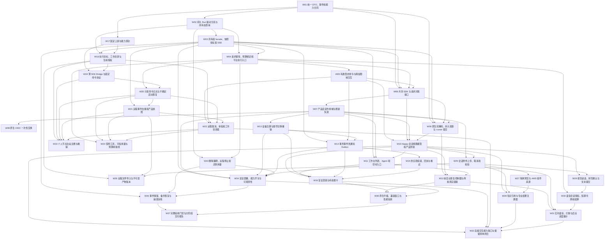
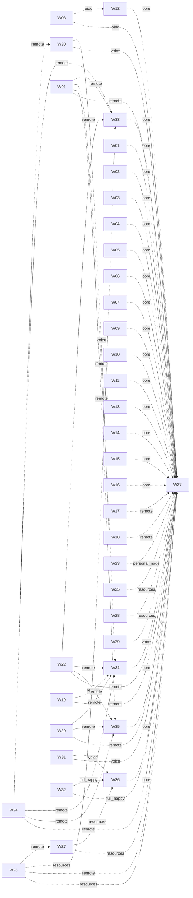

# 移动工作台 DAG 与并行调度参考

本文件供 [Code Agent 执行提示词](2026-09-12-mobile-workbench-code-agent-prompt.md) 在建立队列、申请文件锁和启用 profile 时读取。

## 1. 图的含义与更新

依赖权威为 [任务索引](2026-09-12-mobile-workbench-task-index.json) 和总计划/分册的规格约束。本图是索引的派生视图；实线为直接依赖，虚线标签为启用该能力时增加的依赖。执行前比较索引 hash，变化后重建并检查循环。外部 H 任务、环境和接口锁是附加门槛，不会因图中无边而消失。

索引 SHA-256：`b8637692393443afb83c9f1928d90b065f321c6897e669f0930b3b9bb709a0ae`。

### 直接依赖 DAG（完整 37 节点）



### 条件依赖 DAG（与上图叠加）



## 2. 可以并行的候选

下表是可滚动利用的就绪组合，不是固定波次，也不是承诺实际代码没有共享接缝。每项前置均先 accepted；两个任务仍须通过完整分册和当前改动的冲突扫描。

| 就绪组合 | 启动条件 | 排队/隔离要求 |
| --- | --- | --- |
| W02 ∥ W17 | W01 accepted；W17 测试节点/provider 可用 | Go 持久层与 TS 上游探针分开；W17 持有 pnpm 锁文件所有权 |
| W04 ∥ W19 | 分别满足 W02/W03 与 W17/W18 | 平台准入与薄 Bridge；冻结两侧协议，集成时验证契约 |
| W08 ∥ W09 | W07 及 W09 其他前置 accepted | OIDC 与本地流缓存；分开数据库和原生测试设备，实际 auth 接缝扩大则重排 |
| W09 ∥ W13 | W07 及各自前置 accepted | 流缓存与设备注册；W13 注册路由不能与其他路由任务同写 |
| W10 ∥ W19 | 两者各自前置 accepted | Happy 视图与 Bridge 协议分离 |
| W12 ∥ W15 | W09/W10/W11 和 W14 accepted；OIDC 时加 W08 | 会话恢复与服务端推送；真机链路若共用设备则排队 |
| W25 ∥ W20 | W07/W10 和 W04/W19 accepted | 附件与分发日志；隔离对象存储前缀和执行节点 |
| W23 ∥ W24 | W22 等前置 accepted；托管切片已验收 | 节点注册与费用接线；节点实例/凭据隔离，迁移号单写分配 |
| W26 ∥ W29 | 分别满足 W18/W21/W25 与 W10/W25 | 产物导入与听写 UI；真实测试目标彼此隔离 |
| W27 ∥ W29 | W25 accepted；remote 预览还需 W26 | 预览组件与听写；实际共同页面接线出现时串行 |
| W28 ∥ W30 | W27 等与 W29 等分别 accepted；remote 语音加 W24 | 专业结果页面与语音服务端，路由/容器占用仍需检查 |

W35 与 W36 虽无直接互相依赖，二者都修改 `deploy/mobile-workbench/README.md`，按当前任务边界默认串行。若需要并行，应先显式调整任务所有权并记录接线负责人，保持各自完整验收。

## 3. 必须排队的热点

| 资源/文件 | 涉及任务 | 调度方法 |
| --- | --- | --- |
| `internal/router/routes_workbench.go` | W03/W04/W05/W11/W13/W18/W30 | 一次一个拥有者；先 accepted 再刷新下一任务基线 |
| `internal/container/agent_runtime.go` | W04/W24/W34 | 预算、执行和开关接线按接口稳定次序集成 |
| `internal/container/container.go` / `internal/config/config.go` | W15/W30；W15/W34 | 精确到实际文件的写锁，覆盖新增 wiring |
| `ConversationScreen.tsx` | W12/W28/W29/W31 | 默认串行修改；抽离组件也要由拥有者完成接线 |
| `apps/mobile/sources/app/_layout.tsx` | W07/W16 | 身份上下文与通知路由按前置顺序集成 |
| `pnpm-lock.yaml`、根/移动端 package 文件 | W01/W06/W09/W17/W36 等 | 安装和锁文件更新只保留一个写入者；工作区生成结果要复核 |
| PG/SQLite 迁移目录和测试 schema | 总计划迁移表列出的任务 | 协调者唯一分配号；任务提交自己的迁移；数据库实例/schema 隔离 |
| `agent_run_events.go` | W14/W35 | 通知事务与保留策略按当前接口串行 |
| `agent_run_lifecycle.go` 服务层 | W22/W33 | 取消和清理同写需串行，即使只做 core 子验收也需文件锁 |
| `deploy/mobile-workbench/README.md` | W34/W35/W36 | 各任务串行，最终报告对应集成结果 |
| 台账、验收索引、分支集成 | 协调者/W37 | 协调者单写；W37 产出内容后由协调者统一同步 |
| 端口、测试用户、设备、Paseo 目录、额度账户 | 运行验收任务 | 每任务独立租约；不能隔离时使用队列 |

表格是已知热点；启动前须扫描当前全部 Files 和 Step 4 wiring，补齐新增共享文件及隐式接口冲突。

## 4. 就绪判定伪代码

```text
恢复 ledger，解析索引，展开当前 profile 和继承前置
验证激活 DAG 无环，核对每个生产者/消费者接口
while 仍有未完成任务:
    优先处理已返回的报告、独立审查和修复
    串行集成已经双审通过的任务，并验证集成 SHA
    accepted = 已通过所需子验收且代码已集成的前置集合
    ready = 前置满足、环境可用、当前未运行的任务集合
    从 ready 按核心链优先选最多两个不冲突任务
    为每个任务锁文件/接口/环境，创建独立 worktree 和 brief
    派发新的 implementer；预留 reviewer 槽
    有运行任务则等待其结果；有独立 ready 则继续推进
    无运行、无 ready 时输出各阻塞原因及具体恢复输入
```

图允许并行不等于任务已 ready；最终并发以已接受实现、接口、文件锁、资源租约四者共同决定。
