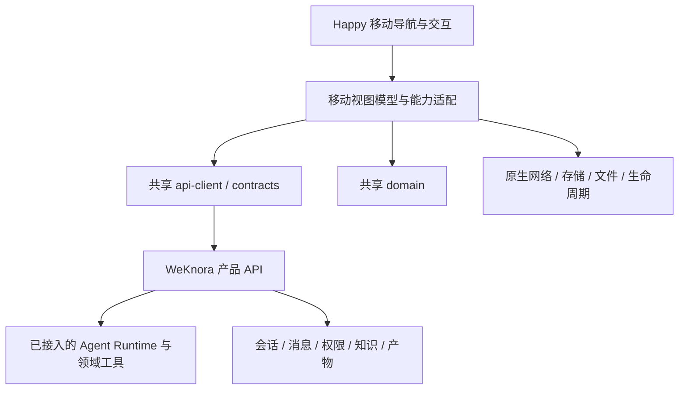

# Happy 统一 Agent 移动客户端设计

日期：2026-09-10。状态：用户已确认产品定位、Happy 交互保留和共享层接入方向；本文为细化规格，尚未实施或原生验收。

## 1. 决策与适用范围

以 `1123786563/happy` 的移动客户端为底座，保留现有移动交互能力，接入 WeKnora 产品后端。客户端同时承载知识问答、通用 Agent 和专业 Agent；知识库是可使用的资源和一种问答入口，不是移动端的信息架构中心。

本规格增补 [React 多端设计](2026-09-10-react-multiclient-design.md) 和 [迁移任务 T20–T23](../plans/2026-09-10-react-multiclient-migration.md)。移动底座与交互范围以本文为准；原有 Web/Wails、租户隔离、共享纯包、发布与验证约束继续生效。没有批准重写全部后端、复制 Happy Server 成为第二套产品数据权威，或将全部专业 Agent 一次实现。

保留交互不等于只留下按钮：每项须记录用户操作、数据来源、服务依赖、成功/失败反馈和原生验收。能力尚未接通时可明确显示暂不可用及原因，但该项仍未验收，不能算作功能保留完成。Happy 的远程机器、语音等依赖能力不得隐性删除；是否保留原服务或实现兼容后端，要在对应能力切片设计中明确。

## 2. 静态证据

- Happy 本地目录 `/Users/wuyongjun/trea/happy`，HEAD 与本次查询的远端 main 均为 `ac64b9b4677870f7b7a9eacfd0780959229717f1`。开发前重新核对工作区；本次未修改该仓库。
- WeKnora 检查时 HEAD 为 `e91f8af0a6269f6b4515a3dde0096ad3ad133717`，存在其他任务的未跟踪规格与计划；本次只增补相关文档，不接管其实现或状态。
- Happy `packages/happy-app/package.json`：Expo 55、React Native、Expo Router；`sources/-session/SessionView.tsx` 导入输入、聊天列表、语音状态、文件/Diff、目标、旁支会话及原生布局能力。这里只做源码抽样，尚未逐屏建立视觉基线。
- Happy `sources/sync/apiSocket.ts`：Socket.IO `/v1/updates`、加密 session/machine RPC；`sources/sync/apiVoice.ts`：专用 voice token/usage 接口。它们不等价于 WeKnora REST/SSE。
- WeKnora `internal/router/routes_agent.go`：Agent 列表、详情、类型预设及管理；`internal/types/custom_agent.go` 已有 `custom`、`data-analysis` 等类型。专业 Agent 是产品定位，不能当作另一个 Runtime 名称。
- `internal/router/routes_chat.go`：会话、消息、停止、continue-stream、知识问答、Agent 问答与产物路由；`routes_infra.go`：审批与 MCP OAuth 处理。
- `internal/types/message.go` 的 `Message.AgentID` 记录每轮 Agent；`SessionLastRequestState.AgentID` 表示最近请求。`SessionListQuery.AgentID` 当前注释明确仅过滤 IM 关联会话，不能直接用作移动全部会话的 Agent 筛选契约。
- `packages/api-client/src/ports.ts`、`chat/stream.ts` 与 `packages/domain/src/chat/reducer.ts` 提供无框架端口和流事件基础；迁移账本的 T02–T10 仍为 review，真实后端/原生能力不能由 mock 测试推定。

本次未运行 Happy、模型、后端、构建或真机测试。外部基线链接：[Happy 固定提交](https://github.com/1123786563/happy/tree/ac64b9b4677870f7b7a9eacfd0780959229717f1)。

## 3. 方案边界

采用 Happy 交互加 WeKnora 适配层：复用已有原生体验，代价是拆开 Happy 视图、存储、加密与远程会话的耦合，且以后更新 Happy 需要逐项合并与回归。

备选一为轻量 Expo 重建，依赖更少，但不符合本次保留 Happy 交互的选择。备选二为完整 Happy Server 与 WeKnora 并存，保留原远程链路更直接，却增加身份、会话归属与部署复杂度；不作为默认架构。如果完整远程 CLI 控制和加密同步无法通过合理的适配实现，再单独评估受隔离的服务桥，不能由移动页面直接串联两套用户凭证。

目标目录沿用 `apps/mobile`；在引入 Happy 源文件时保留其内部组织与别名，避免同时进行无关重排。只引入经过来源、依赖与许可记录的文件；不从相邻 Happy 路径加载生产依赖，不直接照抄整个 monorepo 或执行其发布脚本。

移动不导入 DOM `ui/views` 或 Web `core`。Happy 原生视图继续使用自己的交互组件；SDK 与领域层无 React 依赖。原生凭证、流传输、文件 URI、通知、语音各有平台端口。以可注入接口取代视图直接依赖 Happy 全局 sync/store 的位置，逐个交互迁移；不能只换 base URL。

## 4. 统一会话和 Agent 语义

- Agent 入口展示后端授权可见的 Agent；不强制选择知识库后才能创建会话。不要求首版新建 Agent 市场或新分类数据库。
- 通用和专业 Agent 共用会话、输入、工具、审批和产物交互。专业 Agent 可增加经注册的结构化表单/结果渲染器；未知结果类型提供安全的文本或文件回退，不执行服务端传入的任意 UI 代码。
- 会话可跨轮切换 Agent。发送时记录实际 Agent；历史按消息的 Agent 标识展示，不能随当前选择回写旧消息。执行中切换选择仅影响下一次允许提交的请求，不改变正在执行的归属。
- 执行状态映射后端已有消息与运行记录。旧链路没有稳定 Run ID 时不能伪造持久化 Run 实体；客户端临时请求关联与服务端持久标识明确区分。新 Runtime 可在共享契约中增量扩展。
- 知识、模型、工具、附件可用性由后端权限与 Agent 配置共同决定。前端能力声明用于展示，不授予权限；声明来源未定时由适配层按已核实契约映射，不能宣称现已有 capability endpoint。
- 能力键建议覆盖附件、工具交互、审批、追加、产物、语音、终端和远程机器；专业名称不等于能力，禁用状态必须有原因。

## 5. Happy 交互保留与适配矩阵

下表是首轮能力族盘点，不是全部页面已审结；T20 开始时必须补全部路由/控件/原生手势清单及来源位置。所有行当前均未通过原生验收。

| 交互能力 | 目标映射 | 当前缺口与验收重点 |
|---|---|---|
| 导航、会话列表、搜索与快捷操作 | 产品会话与原生路由 | 逐项核对 Happy 操作和后端端点；不得借 IM Agent 筛选漏掉普通会话 |
| 输入、草稿、附件、键盘与长列表 | Happy 输入/列表，共享发送与文件 SDK | 草稿按服务器/用户/空间/会话隔离；发送失败保留输入；附件权限与取消 |
| Agent/模型选择、工具模式 | 授权 Agent 和模型配置 | 保留选择交互，不将 Happy 的权限模式自动变成后端授权 |
| 正文、思考、工具过程、提问与审批 | 共享事件投影和原生卡片 | pending ID 与消息关联；双击、跨端已处理、超时、拒绝和 OAuth 返回 |
| 停止、重试、追加与前后台恢复 | stop、continue-stream 与实际追加契约 | 停止结果由后端确认；断流不自动重发 prompt；无重放证据时重新取历史 |
| 文件、代码、Diff、产物、预览、分享 | 后端文件/产物与原生渲染 | Happy 的机器路径不当作产品文件 ID；版本与授权准确；Diff/预览能力逐项补齐 |
| 目标操作、旁支会话、fork/archive 等 | 对应产品命令或后端增量 | SessionView 已引用相关交互；尚未核实全量等价 API，保持未验收，不伪造成功 |
| 实时语音与语音状态 | 独立 voice adapter 与后端服务 | Happy voice token/usage 不可直接复用为产品身份；会话归属、错误恢复和费用入口需专项核对 |
| 推送与通知深链 | 设备登记、事件通知与授权深链 | 本次未验证后端推送闭环；退出撤销设备绑定、去重、回到正确空间/会话 |
| 远程机器/CLI 控制与设备切换 | 隔离的 remote adapter / 服务桥候选 | 原 machine RPC/CLI 依赖不能用普通 Agent SSE 冒充；部署与身份方案需专项设计 |
| 设置、主题、语言、响应式与无障碍 | 保留 Happy 移动体验，映射产品设置 | 分清设备设置与账号设置；iOS/Android 大字体、平板、横屏与读屏 |

Happy 原端到端加密是其端点与同步协议的属性，不能因复用 UI 宣称 WeKnora 链路自动继承。产品后端参与 Agent 推理与知识检索时需要处理相关内容；移动令牌安全存储、TLS 与原 E2EE 分别描述。若要求同等级 E2EE 保证，必须另行确定信任边界与执行位置。

## 6. 数据、错误和恢复约束

REST/SSE/文件端点只在共享 SDK 定义；原生 transport 承担 POST、header、增量读取和取消。现有聊天路由保持兼容，不把旧 SSE 当作已迁 AG-UI，也不因新 Runtime 文档改变旧消息解释。

切服务器、切空间、退出时取消旧请求并使旧 generation 失效，清理对应草稿/缓存/订阅；401 走共享刷新协调，失败进入重新登录，403 展示权限不足。所有服务端操作仍检查资源归属。

网络恢复先查会话与消息状态，再按实际契约恢复订阅。不能将 `Last-Event-ID` 请求头存在视为后端重放保证；不能将网络超时解释为生成未发生。未知状态先对账，禁止自动重复付费执行。运行中允许的追加/审批操作只发送后端支持的命令。

## 7. 两条验证链与任务增补

先验证两条不依赖 Web 页面完成的共享协议链：

1. 知识问答：登录、选 Agent/知识资源、提问、流式引用、历史和恢复。
2. 非知识库 Agent：选择不绑定知识库的 `custom` Agent，执行一个受控工具任务，验证工具过程、审批/拒绝、结果和恢复；专业场景后续以现有 `data-analysis` 预设验证附件与结构化结果，不假定模型/工具已部署。

不得为通过第二条链强行增加无关领域业务。真实模型、工具或原生运行条件缺失时，记录具体阻塞；fixture 验证与真实运行分开。

| 迁移任务 | 增补范围 | 退出条件 |
|---|---|---|
| T20 Happy 基础与平台接入 | 固定来源、完整交互库存、保留原生壳、共享认证/网络/作用域 | iOS/Android 登录与列表实测；交互库存每项有去向与服务依赖 |
| T21 知识资源与文件 | 作为 Agent 可用资源接入，保留知识问答入口 | 引用/上传/分享真实验证；非知识库 Agent 可独立进入 |
| T22 统一 Agent 会话 | Happy 视图模型适配、Agent 选择、消息/工具/审批/恢复与两条链 | 两类 Agent 共用交互通过原生与真实后端验收，无重复生成 |
| T23 能力补齐 | 原有管理功能，加矩阵中语音/通知/目标/旁支/远程等缺口 | 每项完整交互和服务验收；未实现能力仍未通过，不以隐藏结项 |

T22 核心依赖 T02–T04、T10 及 T11/T12/T15 的共享 API 契约；不依赖这些任务全部 Web 页面。附件/引用/产物验收仍依赖 T07/T13/T21 对应能力。可分别记录前置满足情况，不能绕过契约与权限证据。

T23 现在包含新增的 Happy 服务适配工作，原 T20–T23 人日及总工期估算不再可直接用于承诺；完整交互库存后拆分语音、通知、远程与专业展示切片并重估。现有 Craft 规格排除移动原生 Craft 首版，本规格保留扩展位置，不自动扩大该任务交付范围。

## 8. 验证与交付证据

- 共享层：两类 Agent fixtures、消息归属、事件去重、审批竞态、切空间迟到事件与无权限负例。
- 适配层：既有 Happy 操作到 SDK 命令映射、未知能力/结果的安全回退、凭证刷新、取消与断线。
- 原生：iOS 和 Android 各自验证键盘、安全区、长列表、文件选择/分享、后台恢复及通知/语音相关能力。
- 真实后端：登录、两条 Agent 链、历史、停止、审批、重连；记录服务/模型/客户端版本和脱敏证据。
- 交互保留：固定 Happy 基线的逐屏截图与操作对照；源码存在不能替代可用性验收。

完成定义：首批可交付核心链路，但必须报告其余矩阵项；只有矩阵全部验收或用户明确变更范围，才能声称完整保留 Happy 移动能力。本次交付仅为设计、术语与既有任务边界同步。

实施任务见 [详细实施总计划与七个子计划](../plans/2026-09-10-happy-agent-mobile.md)。计划编写不表示应用实现或原生验收已开始。
