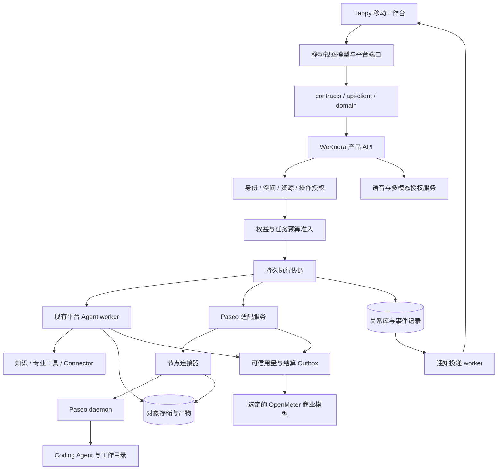
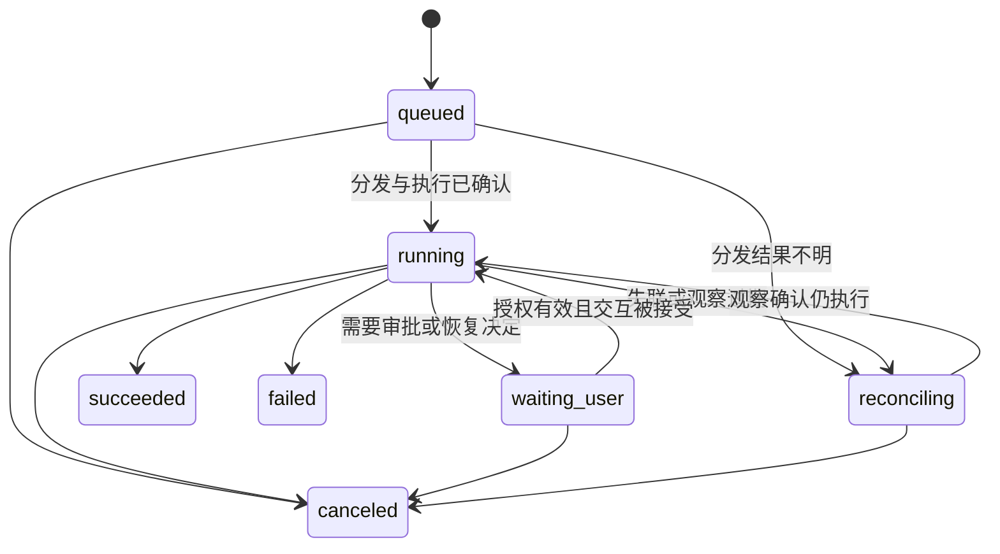
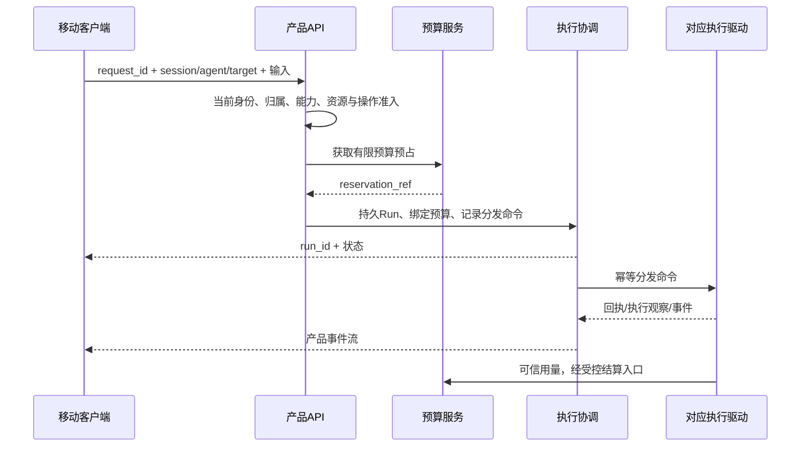

# 移动端 AI SaaS Agent 工作台技术架构

日期：2026-09-12。版本：0.1。状态：架构评审稿。

本文件根据当前仓库源码与 Paseo、Happy、AWS Mobile AI Assistant 官方资料编写。用户已要求编写详细技术架构；本文中的新增接口、数据字段、部署形态和验收指标是设计建议，不表示已经实现、通过验证或获准实施。

## 1. 架构结论与适用范围

采用 **Happy 移动底座 + WeKnora 产品与执行控制 + Paseo 远程编码执行接入 + AWS 示例多模态交互复用**。

| 层次 | 选择 | 主要职责 |
| --- | --- | --- |
| 原生客户端 | 当前 `apps/mobile`，Expo / React Native / Happy 组件 | 输入、任务状态、审批、文件和产物、通知、语音 |
| 共享客户端层 | `packages/contracts`、`api-client`、`domain` | 契约校验、API、事件投影、作用域与错误处理 |
| 产品 API 与控制 | 现有 Go / Gin 服务 | 用户、空间、会话、资源授权、任务准入、执行控制 |
| 平台执行 | 现有 Agent Runtime，优先使用具备持久恢复的 tRPC 路径 | 通用和专业 Agent、知识、工具、检查点和恢复 |
| 编码执行接入 | 新增薄 TypeScript Paseo 适配服务 | SDK 调用、协议隔离、远程运行映射、事件转换 |
| 商业 | 现有商业域与选定的 OpenMeter 模型 | 权益、预算、预占、可信用量与最终商业结算 |
| 多模态与语音 | 平台能力端口；按需接入服务商 | 上传、图像、语音、产物渲染；参考 AWS 示例实现 |
| 基础设施 | 现有关系库、对象存储和运行环境 | 持久状态、事件、文件、备份、观测 |

默认面向需要在手机上发起、监督、审批和接收 Agent 工作成果的 SaaS 用户。Coding Agent 是其中一种能力；知识库是可使用的资源，不是创建所有会话的前置条件。

首批可交付范围是平台 Agent 会话闭环、任务工作台、审批和恢复；Paseo、多模态、语音按独立能力切片交付。分批交付不取消原 Happy 交互保留要求，未交付能力继续保留在清单中。

暂不建设：第二套 Happy SaaS 后端、第二套商业钱包、移动本机长期 Agent worker、通用原生插件执行平台、全自动跨引擎上下文迁移。私密 E2EE 远程执行作为独立后续模式，不混入首版托管承诺。

## 2. 现状与证据边界

本轮源码基线：`700ef41033a7d1b371abbc8cbac22ade25135ee0`。开始写作时工作区 `git status --short` 无输出。以下是源码阅读结果，非运行验收。

所有本地链接相对本文所在目录，指向本仓库实际文件。

| 证据 | 已核实内容 | 对架构的影响 |
| --- | --- | --- |
| [领域词汇](../../../CONTEXT.md) | 统一 Agent 移动客户端、空间独立付费、任务预算和 Connection 边界 | 沿用已有领域定义 |
| [移动清单](../../../apps/mobile/package.json) | Expo 55、RN 0.83.1、React 19.2.0、Happy wire 及共享包依赖 | 延续现有框架，依赖存在不代表功能接通 |
| [产品认证](../../../apps/mobile/sources/weknora/auth/session.tsx)和[根布局](../../../apps/mobile/sources/app/_layout.tsx) | 产品服务器与认证 Provider、SecureStore 凭证 | 继续补齐作用域、刷新和生命周期 |
| [会话页面](../../../apps/mobile/sources/-session/SessionView.tsx) | 直接导入 Happy sync、store、ops | 必须做视图模型适配，不能仅换 base URL |
| [原 Socket](../../../apps/mobile/sources/sync/apiSocket.ts) | Socket.IO `/v1/updates` 和加密状态 | 与 Go REST/SSE 是两套协议 |
| [共享作用域](../../../packages/domain/src/scope.ts) | AbortController 与 generation 失效机制 | 作为切服务器、用户、空间的客户端基础 |
| [流 SDK](../../../packages/api-client/src/chat/stream.ts) | 旧知识/Agent SSE 请求与解析 | 需新增持久 Run 流适配，不能自动推定已有重放 |
| [Run 契约](../../../internal/agent/runtime/contracts.go) | Tenant/RunKey、Fence、RunEvent.Seq、RequestID、Revision | 增量扩展持久执行，避免重新创造生命周期系统 |
| [运行装配](../../../internal/container/agent_runtime.go) | 独立 HTTP 生命周期的 worker 与沙箱恢复钩子 | 手机离线不应决定执行存活 |
| [Run handler](../../../internal/handler/session/agent_run.go) | 所有权检查、查询、事件重放、决策；能力固定写为 trpc | 泛化前必须调整能力来源和 DTO |
| [运行取消](../../../internal/application/service/agent_run_lifecycle.go) | 先持久化 canceled，再调用取消钩子 | 产品取消与外部进程停止必须分开表示 |
| [运行决策](../../../internal/application/service/agent_run_decisions.go) | 现有动作是 retry/provide_result/terminate | 不是通用 approve/reject 接口 |
| [商业执行](../../../internal/application/service/commercial/execution.go) | 预算预占、dispatched 标记与结算入口 | 新入口必须经过同一商业边界 |
| [OIDC SDK](../../../packages/api-client/src/auth/oidc.ts) | 原生 exchange 明确不可用 | 不把浏览器 token fragment 流直接搬到手机 |

历史[构建报告](../../evidence/happy-mobile-build-verification.md)记录过双平台编译和模拟器启动，但本文未重跑，也不据此认定聊天、审批、远程和商业闭环已可用。未审计其他 worktree、全部 Web 页面、全部后端调用点或外部部署。

### 2.1 与现有文档的关系

- [Happy 移动设计](2026-09-10-happy-agent-mobile-design.md)：继续作为已确认产品方向与交互保留约束。
- [React 多端设计](2026-09-10-react-multiclient-design.md)：共享纯包和原生边界继续有效。
- [商业设计](2026-09-10-saas-billing-connectors-design.md)：空间付费、OpenMeter 权威、预算、BYOK 和连接授权不改变。
- [移动总计划](../plans/2026-09-10-happy-agent-mobile.md)：H01–H35 继续是现有交付索引。
- [远程子计划](../plans/2026-09-10-happy-mobile-06-remote.md)：H24/H25 原先细化了 Happy 服务绑定与 RPC。本稿建议新增 Paseo 驱动并重新评审默认接入，属于明确的方案调整；本文不静默将原计划改为已替换或已完成。
- 写作期间工作区新增了已接受的 [ADR-0001](../../adr/0001-open-connector-shared-runtime.md)及 [open-connector 设计](2026-09-12-open-connector-integration-design.md)。本稿已交叉核对：Connector 继续按私网共享运行时、WeKnora 管理空间与连接授权的方向接入；该共享服务与 Coding Agent 的隔离执行环境是不同边界。本轮只编辑本架构文件，不接管这些并行文档的状态。

## 3. 三项目复用边界与替代方案

### 3.1 Happy：复用移动体验

复用导航、输入、键盘适配、消息展示、工具交互、文件/Diff 和已有移动能力结构。将产品数据访问收敛到 WeKnora 适配层，原 `happy-wire` 仅留在确有 Happy 协议兼容需要的边界，不成为产品领域协议。

上游来源继续以仓库[来源清单](../../migrations/happy/source-manifest.json)与交互矩阵追踪。引入文件和依赖需要记录固定提交、路径、许可证与本地改动。当前来源清单的目标路径存在历史目录写法，后续核验时以实际文件映射为准。

### 3.2 Paseo：复用执行接入

官方仓库提供 daemon、客户端 SDK、协议包、多种 Coding Agent 接入与可选 relay。建议薄适配服务优先使用公开 `@getpaseo/client`，避免依赖内部模块和将上游类型扩散进 Go 产品 API。[官方仓库](https://github.com/getpaseo/paseo)、[架构说明](https://github.com/getpaseo/paseo/blob/main/docs/architecture.md)。

不直接采用其用户、机器、文件路径作为 SaaS 权限证明；不假定上游具备平台所需的启动幂等、租户隔离、撤销强制和可信计费。每项通过固定版本的适配契约测试后才可对客户端声明支持。

### 3.3 AWS Mobile AI Assistant：复用交互与能力实现经验

参考多模态附件、Markdown/图表、图片生成、产物预览、语音和后台进度体验。其官方示例是 React Native 应用，具有模型配置与本地历史等个人使用特征；不直接承担 WeKnora 的团队权限和商业后端。[官方仓库](https://github.com/aws-samples/sample-mobile-ai-assistant)。

逐个移植可独立组件或算法，不合并另一套 RN 工程、导航和历史数据库。不强制引入 AWS Lambda/API Gateway；Bedrock 是可选模型服务商，平台继续统一凭据和收费归属。

### 3.4 方案比较

| 方案 | 收益 | 代价 | 适用条件 |
| --- | --- | --- | --- |
| 本稿：Happy + WeKnora，增量接 Paseo | 保留已投入移动与 SaaS 代码，覆盖非编码任务 | 需要解耦 Happy 与治理远程执行 | 当前统一 Agent 工作台目标 |
| Paseo 作为主产品，WeKnora 提供知识服务 | 编码、机器与项目体验更直接 | SaaS 权限、计费和非编码产品流程要重建 | 主要用户为操作自己电脑的开发者 |
| 轻量 Expo 重建，参考 AWS 示例 | 初始依赖和视图结构可控 | 丢失 Happy 已有交互，需要重新实现和验收 | 用户明确缩减 Happy 交互保留范围 |

## 4. 总体结构与数据权威



节点连接器是本稿建议新增的出站通信组件，不是已经存在的 Paseo 功能。它可与 daemon 同机部署；托管环境也可通过私网由 Bridge 直接连接，省去连接器。

| 对象 | 唯一权威 | 其他组件允许持有 |
| --- | --- | --- |
| 用户、空间、成员、资源权限 | WeKnora | 有效期有限的授权上下文 |
| 产品会话与消息 | WeKnora | 客户端缓存、外部运行映射 |
| 产品 Run、审批、预算 | WeKnora | worker 租约与签名执行授权 |
| 外部进程是否存活及退出结果 | 执行节点的可核实观察 | 平台保存观察及其时间、新鲜度和不确定性 |
| 工作目录中的文件 | 所属执行环境 | 显式导入后的不可变产物版本 |
| 平台产物与访问授权 | WeKnora 元数据与对象存储 | 有期限的读取链接 |
| 最终 Credits 商业消费 | 已选定的 OpenMeter 模型 | 平台准入投影、原始用量、结算状态 |
| 推送、Live Activity、本地状态 | 均非业务权威 | 可重建的状态提示 |

平台 Run 是业务控制与观察记录，不自动证明远程进程停止；节点报告也不能越过平台权限创建、复活或转移产品 Run。

## 5. 领域模型和数据设计

### 5.1 概念与标识

沿用 CONTEXT 中的空间、通用 Agent、专业 Agent、知识资源、任务预算、Installation 和 Connection。以下新增技术概念仅在本稿定义，待评审后再决定是否进入领域词汇。

| 概念 | 含义与约束 |
| --- | --- |
| Session | 会话。保留现有个人所有权；空间协作不等于空间成员自动可读所有会话 |
| Run | 一次持久执行。归属固定空间、用户、会话和预算；持久化后不可跨空间移动 |
| Attempt | 同一 Run 中的一次执行尝试。重试生成新 Attempt，不覆盖旧结果和费用 |
| ExecutionTarget | 执行目标：platform、managed_node、personal_node；不等同于 Agent 类型 |
| ExecutionWorkspace | 节点上的工作目录引用。不是 Tenant；跨设备 ID 映射不得用绝对路径代替 |
| ExecutionBinding | 产品 Run/Attempt 与外部 daemon/agent ID 的绑定 |
| PendingInteraction | 待处理交互的统一展示投影，指向真实审批或恢复决策，不另造批准权威 |
| ArtifactVersion | 导入平台后的产物版本，绑定空间、会话、Run、内容摘要和存储对象 |

`agent_id` 表示产品 Agent；`driver` 表示执行接入方式；`engine_type` 保留现有 builtin/trpc 语义；`target_id` 表示执行位置。不能把 `paseo` 填入当前只支持 builtin/trpc 的解析器。

### 5.2 数据增量

以下是逻辑数据模型；表名和字段需通过数据库迁移设计冻结，不能视为现有 schema。

| 记录 | 关键字段 | 约束与索引 |
| --- | --- | --- |
| 现有 agent_runs 扩展 | driver、target_id、parent_run_id、budget_ref、policy_version | 保留 tenant/run 主键；旧记录显式兼容映射；worker 只领取所属 driver |
| execution_targets | id、tenant_id、owner_id、kind、visibility、status、credential_version、last_seen | 默认个人可用；首版一目标绑定一个空间；授权列表独立存储 |
| execution_workspaces | id、tenant_id、target_id、root_ref、repository_ref、capabilities | 服务端解析 root_ref；同目标规范化路径唯一；限制路径和符号链接逃逸 |
| execution_bindings | tenant_id、run_id、attempt_id、target_id、external_agent_id、source_generation、observed_status | 同 Attempt 仅一个活动绑定；外部 ID 在目标内唯一映射；回调反查归属 |
| dispatch_commands | command_id、run/attempt、kind、payload_hash、lease_epoch、state、receipt | 同命令 ID 内容不可变；唯一索引驱动去重；unknown 不能按失败重发 |
| execution_observations | binding、source_event_id、observed_at、process_state、exit_code、evidence_ref | 允许取消后记录观察；不能修改 Run 终态或发起新动作 |
| device_registrations | device_id、user_id、app_environment、token_ref、revision、revoked_at | 推送 token 加密存储；一设备切账号更新绑定而非复用旧权限 |
| notification_deliveries | event_id、recipient、device_id、state、attempt、next_attempt_at | event/recipient/device 唯一；过期事件停止重试 |
| artifact_versions | tenant、session、run、version、digest、mime、size、object_key、scan_state | 内容与引用不可变；读操作重新鉴权；预览状态独立 |

既有 Run 事件、预算、审批、Connection 和商业 Outbox 优先复用。若已有表能承担新字段则增量扩展，不创建同义表。

平台执行与外部执行共用产品 Run 存储，生命周期分别由相应 driver 驱动。统一 API 的 Execution DTO 是 Run 的投影，不建立另一张可独立推进状态的“移动任务表”。builtin 旧会话没有持久 Run 时只展示历史执行状态，并声明不可恢复；不能伪造持久 Run。

### 5.3 必须保持的不变量

1. 任何 Run、事件、附件、审批都通过服务端认证上下文和持久所有权解析空间。
2. 同一请求 ID 与相同参数重放返回原 Run；同 ID 不同参数返回冲突。
3. 会话默认只允许一个活动 Run；跨轮换 Agent 不修改历史归属。远程仍未确认停止时保留工作目录执行锁。
4. 旧 worker 失去 Fence 后不能推进业务事件或授权新工具调用。
5. 取消、失败和超时不抹掉实际用量，也不意味着外部副作用已回滚。
6. 预算授权、工具操作批准和连接授权是三件独立的事。
7. 子 Run 共享父任务预算树，不能复制一份可消费余额；新增子执行仍需授权和准入。

## 6. 移动端模块架构

### 6.1 目标目录

保留 Happy 内部文件结构，新增产品适配目录。下面新增目录是目标布局，并非全部已存在。

```text
apps/mobile/sources/weknora/
  auth/            产品登录、刷新、退出、原生回调
  platform/        网络、作用域、存储、生命周期、文件 URI
  workbench/       任务列表、筛选、待处理交互
  conversations/   会话视图模型、输入和历史映射
  executions/      Run 状态、事件投影、取消和恢复
  resources/       知识、附件、产物
  remote/          执行目标与工作目录选择
  notifications/   设备登记、深链、前后台提示
  voice/           录音、实时连接、打断和权限
  renderers/       已注册的结构化结果组件
packages/contracts/src/mobile/       版本化 DTO 与校验
packages/api-client/src/mobile/      产品 API 与流协议封装
packages/domain/src/mobile/          无框架状态与纯逻辑
services/paseo-adapter/               新增薄适配进程
```

Web/Wails 可以共享 DTO 和纯逻辑；原生不得导入 DOM 页面、Web 专用 UI 或浏览器存储。前端不导入 `services/paseo-adapter` 或上游 daemon 内部实现。

### 6.2 视图适配

以 `ConversationViewModel` 为页面唯一产品数据入口，向 Happy 组件提供消息、工具、待处理交互、产物、发送状态和能力信息。逐项将直接 store 读取改为注入或受控 hook；发送、停止、追加、审批、文件操作通过有类型的 command facade。

不提供 `invoke(method: string, args: unknown)` 给页面；操作使用固定命令类型。未知工具结果渲染为安全文本/文件入口，不执行后端传入的任意组件代码。

能力状态采用 `supported | unavailable | forbidden` 与原因码。支持性来自驱动能力，权限来自当前服务端决策；移动端只用于展示，服务端仍复查。未接通的远程、语音、旁支功能保留清晰反馈，不伪造成功。

### 6.3 缓存与生命周期

- 缓存命名空间为服务器 origin、user_id、tenant_id；会话内再区分 session_id。
- generation 只用于内存请求失效，不作为唯一持久缓存键。切作用域取消旧请求、订阅和录音，并丢弃迟到响应。
- SecureStore 存放令牌和本地加密密钥；消息缓存使用可索引的本地数据库并按敏感度加密，MMKV 只承担小型设置与索引提示。
- 草稿可离线保存；首版不自动补发离线 Agent 执行、审批或购买命令。恢复后由用户提交或按原请求 ID 对账。
- 文本增量批量投影并更新列表；大型代码、Diff、图表延迟加载、限制大小。不能将完整事件历史在每个 token 上重新计算。
- 前台恢复先查询 Run 与待处理交互，再按 cursor 补事件；Push 和本地“运行中”标记不能证明当前服务端状态。

## 7. 执行控制与 Paseo 集成

### 7.1 驱动边界

执行协调服务负责准入、Run 所有权、租约、命令记录、状态投影和恢复调度。平台 driver 调用现有 tRPC worker；Paseo driver 调用 Bridge。新增 driver 前要修改现有 worker 的领取条件，防止 tRPC worker 领取远程任务。

Bridge 的逻辑操作为 DescribeCapabilities、Start、Observe、ReadEvents、SubmitInteraction、Steer、Cancel、ExportArtifact。它们是 WeKnora 内部契约；与 Paseo SDK 的具体方法逐项映射，不能假定存在同名 API。

桥不持有用户长期产品 Bearer，也无权直接写商业账本。命令带 command_id、run_id、attempt_id、目标、租约 epoch、授权版本、有效期和参数摘要；接收端同时检查服务身份与命令范围。

### 7.2 两种连接部署

| 类型 | 连接方案 | 安全和可靠性边界 |
| --- | --- | --- |
| 托管节点 | Bridge 私网连接该隔离环境中的 daemon | 每空间/任务隔离身份、文件系统和凭据；无公共任意地址入口 |
| 用户机器 | 同机连接器主动建立到平台的认证出站连接，再连本地 daemon | 默认个人目标；一次性注册挑战、密钥轮换、命令期限；手机不直传任意 daemon URL |

第一版 Paseo 切片先选一台受控节点和一个提供方，不同时开发公网 relay、自带节点、多 provider。用户机器接入需额外通过离线撤销和可见权限边界测试。

自带节点的所有者可修改本机程序，因此节点自报数据不是平台强计费或强隔离证明。商业用量只采用平台观测到的可信调用；要求组织治理的执行必须使用平台可控制的网关和环境。

### 7.3 启动幂等与不确定结果

1. 产品 API 校验权限、预算和请求 ID，持久化 Run 与待发送命令。
2. 预算服务预占成功后记录准入结果；跨模块不能原子提交时用可恢复步骤协调，不持有数据库事务等待网络。
3. 执行端先记录 command_id 和参数摘要，再启动外部 Agent；成功观察后记录外部 ID 和回执。
4. Bridge 断线后查询命令回执、绑定和外部状态，不直接再调用 Start。
5. 若上游不支持幂等启动，也无法可靠按关联信息查询，保留 `dispatch_unknown`。不可用概率猜测自动生成第二个执行。
6. 未分发就失败可释放预占；分发结果不明保留有限待核对状态，由恢复任务处理。

本地命令日志本身不能消除“进程已启动、绑定尚未落盘”的窗口。该窗口必须有可验证的查找机制；没有时暂停并人工确认，是首期可接受的失败行为。

### 7.4 状态模型

现有平台 Run 的具体 wire 状态保留。下图是统一产品投影，新增状态需版本化映射，不直接向旧客户端写入未识别值。



统一 DTO 同时返回 `run_status`、`execution_status`、`settlement_status`。例如用户取消后可为 `canceled / stop_unconfirmed / pending_reconciliation`，UI 展示“已撤销任务，远程停止待确认”。

取消后禁止新收费步骤与新工具授权；远程节点失联时不能声称立即停止本地自主进程。保留工作目录锁直到观察确认退出、受控环境被销毁，或人工明确接管。迟到用量走独立结算入口，不能通过旧 worker 复活 Run。

### 7.5 远程工具与沙箱

平台受控 Connector 操作必须回到 WeKnora 授权入口执行。Coding Agent 自带 shell 若能直接访问互联网和长期凭据，平台就无法声称每次外部写入受审批控制。

涉及 open-connector 时，路径为 Agent → WeKnora ActionService → 受限 Dispatcher → 私网共享 open-connector。节点只得到本次调用所需的平台授权引用；不获得 open-connector 管理凭据，也不直接连接其控制台或管理 API。普通运行 Token 按已授权连接与动作限制。工具记录引用同一 Action ID，避免 Runtime 和 ActionService 各做一次审批消费或预算预占。

托管模式采用非特权用户、隔离 HOME/工作目录、短期凭据、网络出口策略和资源限额；不挂载宿主 Docker socket。Worktree 只用于文件版本分离，不是租户安全隔离。

个人模式明确显示“在你的机器权限范围内运行”，不提供平台强制治理承诺。不得将平台服务密钥注入任意用户机器。首批远程目标不允许多人并发控制同一工作目录。

## 8. API、事件与版本兼容

### 8.1 已存在的接口

| 接口 | 当前含义与限制 |
| --- | --- |
| `POST /api/v1/sessions` | 创建现有产品会话 |
| `POST /api/v1/agent-chat/:session_id` | 现有 Agent 请求入口，按已实现契约调用 |
| `GET /api/v1/sessions/:id/runs/:run_id` | 持久 Run 查询；当前能力描述绑定 tRPC |
| `GET /api/v1/sessions/:id/runs/:run_id/events` | 持久事件；支持 after/Last-Event-ID、once；过期返回 cursor_expired |
| `POST /api/v1/sessions/:session_id/runs/:run_id/decisions` | retry/provide_result/terminate 恢复决策 |
| `POST /api/v1/sessions/:session_id/runs/:run_id/cancel` | 持久取消，不能作为远程 kill 已确认的证据 |
| `GET /api/v1/sessions/continue-stream/:session_id` | 旧活跃流恢复，不等同于上述持久事件协议 |
| `POST /api/v1/commercial/tasks/:id/budget/extend` | 预算提升，不能替代工具审批 |

### 8.2 建议新增的工作台 facade

以下路径全部为新增提案，最终需加入契约生成和路由测试。Facade 面向多端，不建立移动专属第二套业务实现。

| 接口 | 作用与关键参数 |
| --- | --- |
| `GET /api/v1/workbench/capabilities` | 协议版本、已部署能力与原因；不作为授权凭证 |
| `GET /api/v1/workbench/executions` | 当前用户获准查看的 Run 聚合；status/agent/cursor；无全空间默认可见 |
| `POST /api/v1/workbench/executions` | session_id、agent_id、target_id、workspace_ref、输入、预算请求、request_id |
| `GET /api/v1/workbench/requests/:request_id` | 请求超时后的已准入查询；返回原 Run 或确证未受理 |
| `GET /api/v1/workbench/executions/:run_id` | 统一 Run、执行观察、结算与能力 DTO |
| `GET /api/v1/workbench/executions/:run_id/snapshot` | 完整可重建投影与一致 watermark；水位和内容需来自同一一致性边界 |
| `GET /api/v1/workbench/executions/:run_id/events` | 标准化事件订阅和重放 |
| `POST /api/v1/workbench/executions/:run_id/commands` | 有类型的 cancel/steer；command_id、expected_revision |
| `GET /api/v1/workbench/interactions` | 已授权待处理投影，区分工具批准、预算请求和恢复决定 |
| `POST /api/v1/workbench/interactions/:id/decisions` | decision_id、expected_revision、typed action；路由到真实权限域 |
| `GET /api/v1/execution-targets` | 只返回获授权执行目标及能力 |
| `POST /api/v1/execution-targets/registrations` | 一次性注册挑战；确认目标归属后签发节点凭据 |
| `POST /api/v1/execution-targets/:id/revoke` | 撤销目标新执行权，触发运行中的停止协调 |
| `PUT /api/v1/mobile/devices/:id` | 设备通知绑定；令牌、应用环境与版本；服务端确定用户 |
| `DELETE /api/v1/mobile/devices/:id` | 撤销设备通知绑定 |

附件和商业 API 继续复用原接口；确有原契约缺口再扩展，不重复定义购买和上传服务。

### 8.3 统一事件契约

产品事件最小字段：`schema_version`、`run_id`、`attempt_id`、`seq`、`type`、`occurred_at`、`payload`。产品层 `seq` 由持久存储分配；Paseo 原序号保存在 source 元数据中，不直接当作产品 seq。

事件类别：文本增量、工具开始/完成、交互请求/解决、产物创建、状态变化、用量更新。精确枚举在 contracts 固定；未知事件保留安全诊断且不阻断已知事件。

兼容规则：

- 当前 handler 使用 `c.SSEvent(strconv.FormatInt(e.Seq, 10), e)`，序号被放在 event 名和 JSON 的 seq 中，并非标准 `id:`。现有适配器显式读取 payload.seq；新 facade 同时输出标准 id 和 payload.seq。
- 重放按 `(run_id, seq)` 去重。重试使用新 attempt_id；来源去重采用 binding + source_generation + source_event_id，禁止按文本内容去重。
- 只有更新本地投影成功后才前移本地 cursor，崩溃后允许重放。
- cursor 过期时读取带一致 watermark 的投影快照，再接 watermark 之后的事件。快照协议是新增能力，未完成时重新加载可验证历史并提示过程记录不完整。
- 历史与在线消息通过稳定 message/tool/artifact ID 合并，不能使用标题或文本相等判断。
- 中间断流与终态必须区分；终态查询前不自动重发输入。

协议版本由 facade 维护。Bridge 与 daemon 固定兼容矩阵，最低支持版本外返回不可用；原生 App 升级滞后时服务端保留已发布版本兼容窗口。驱动原始事件仅保留必要诊断信息并脱敏。

## 9. 关键业务时序

### 9.1 发起平台或远程任务



预占成功而 Run 未完成持久化的中间状态必须由相同 request_id 恢复或补偿；先写 Run 还是先预占是实现事务设计的一部分，但任何路径不得先启动后补授权。

### 9.2 手机后台与恢复

1. App 后台或进程结束不发送取消；关闭本地连接只释放订阅。
2. 服务端持续持久化事件，待审批、完成、失败通过 Outbox 生成通知。
3. App 回前台恢复身份与空间；查询原 Run 状态和待处理交互。
4. 按本地已提交 cursor 恢复事件。权限已撤销则清理缓存并显示不可访问。
5. 已完成直接展示权威结果；运行中继续订阅；结果未知展示核对中。

### 9.3 审批竞态

审批内容包含真实资源、参数摘要、动作和影响，绑定 pending_id/tool_call_id、参数 hash、权限版本、有效期。手机提交 decision_id 和 expected_revision 后由原审批域执行 CAS。

桌面已经批准、请求过期、参数变化、连接撤销分别返回可区分结果。任何重试都重新校验当前权限。预算增加只能解决额度暂停；恢复中的 provide_result 不能用于伪造外部写入成功。

## 10. 身份、授权与加密

### 10.1 产品身份

沿用产品 Bearer/刷新体系，通过共享刷新协调器避免并发刷新。401 刷新失败退出；403 显示无权限；资源归属错误保持现有不泄漏存在性的响应方式。

原生 OIDC 需要新增一次性 code 交换与受控回调流程，包含 state、回调白名单和适用的 PKCE；现有 `exchange` 不可用时维持明确禁用。不得把 URL fragment 中的长期 Bearer 转存为新移动登录方案。

### 10.2 授权分层

授权链为：当前成员 → 会话所有权 → Agent 可见性 → 执行目标/工作目录 → 知识与 Connection → 具体工具操作 → 套餐/预算。任何一层失败均不得绕到其他执行后端自动重试。

空间 Admin 不自动获得所有个人会话或个人 Connection，也不自动拥有账单管理员权限。共享任务必须另行定义显式授权，不借工作台聚合接口扩大权限。

### 10.3 信任模式

| 模式 | 内容可见范围 | 可提供的能力 |
| --- | --- | --- |
| 平台托管，首版 | 平台为执行和知识处理接触必要明文；TLS、静态加密、受控访问 | 检索、服务端工具、内容审计、可信用量 |
| 用户机器、平台可见远程流 | 手机、Bridge、执行节点及所用模型服务 | 统一工作台；本机自主动作只能提供有限治理 |
| 私密 E2EE，后续独立设计 | 定义好的用户端点与执行端点；模型服务信任另述 | 加密同步；平台内容检索、审核与语义索引受限 |

不能因 relay 使用 E2EE 就声称平台 Bridge 看不到内容；若 Bridge 是解密端点，平台就在信任边界内。首版 UI 和隐私说明按实际链路描述。

### 10.4 撤销与离线

目标撤销后平台立即停止发新命令、撤销短期授权并请求停止。在线受控节点须在验收时限内响应；离线个人节点的自主执行不可保证远程立即终止。对强治理场景，模型访问和外部操作必须经过可撤销网关，否则该目标不具备强治理能力。

## 11. 商业计量与成本控制

### 11.1 计费边界

继续遵守现有商业设计：空间独立承担费用；OpenMeter 的选定模型承担最终商业消费；平台预算服务负责有限任务预算、并发占用、原始用量和对账。禁止手机根据余额数字自行准入或结算。

| 执行来源 | 平台可计量项 | 不应重复计费的项 |
| --- | --- | --- |
| 平台模型 + 平台 worker | 实际模型、沙箱、解析、Connector 等已声明项目 | 不能将事件条数当 Token |
| 平台托管 Coding Agent | 平台网关观测的模型用量与执行资源 | 无可信观测时不按模型报告扣 Credits |
| 用户机器 + BYOK/用户自有服务 | 已明确提供并计量的平台服务 | 用户直接承担的模型调用 |
| 语音与图像 | 实际服务商用量与平台能力计量 | 不能在 text 和 audio 两侧重复计算同一收费事实 |

第三方 CLI 的账号授权不自动等于允许平台商业转售；上线某提供方前核实其实际部署与授权条件。未经验证不承诺支持特定订阅供多人共享。

### 11.2 结算流程

准入 → 预占 → 标记分发 → 记录可信用量 → 持久结算 Outbox → OpenMeter 去重投递 → 对账 → 释放剩余占用。每条用量包含来源事件 ID、空间、任务、Run/Attempt、计量单位、数量、计价版本与可信来源。

跨服务按至少一次交付设计，使用业务幂等键避免重复商业消费。输入追加、子任务、模型切换、语音会话续期重新校验预算。失败与取消仍结算实际消耗；结果不明先核对，不能自动释放全部占用造成超卖。

### 11.3 运营成本

初期沿用已有 Go/数据库/对象存储，不为本功能单独引入 Kafka 或工作流平台。先用数据库命令表、Outbox 和有限 worker，出现经测量的吞吐瓶颈再拆分。

成本模型为：基础服务 + 模型输入输出 + 执行环境时长 + 语音时长 + 产物存储/流量 + 观测与通知。对比用户机器与托管模式时，分别计算平台资源成本和远程离线支持成本。

本稿未设定用户量、区域和模型组合，因此不承诺月费。Bedrock 定价随模型、模态和服务档位变化；采用其能力前按实际组合估算。[官方价格](https://aws.amazon.com/bedrock/pricing/)。

移动购买入口作为单独发布切片，按目标商店、地区和发行方式确定可用支付路径；本稿不把现有 Web 微信/支付宝支付流程直接认定为原生商店可发布方案。

## 12. 产物、多模态与语音

### 12.1 文件与产物

上传先创建带空间/会话归属的记录，再用受限上传授权传输；完成后校验大小、摘要、真实类型和扫描结果。远程文件通过明确的 ExportArtifact 操作导入，不允许手机传任意绝对路径读取宿主文件。

图片、文档、代码和 Diff 分别有渲染器及大小上限。跨空间共享使用现有共享授权或显式复制，不修改原文件归属。签名 URL 短时有效、限定对象，不写日志；删除先撤销访问引用，再按保留策略清理内容。

生成 Web App 是一种 ArtifactVersion，采用隔离 origin 的预览服务。预览无产品 Cookie/Bearer、无任意原生桥、无内部网络访问；能力调用须经显式受控后端授权。首版可只提供静态预览，动态应用发布另行设计。

### 12.2 语音

先提供按住说话 → 转写 → 用户确认/编辑 → 普通消息提交，复用文本执行链。再提供实时语音：产品 API 检查会话和预算后签发短期供应商会话凭据，音频走专用连接，控制与产物仍走产品 API。

麦克风拒绝、来电、蓝牙切换、后台中断均有可见状态。打断播放与取消 Agent 执行是不同命令。转写含糊不能自动批准高影响工具动作；仍通过结构化审批卡片确认。

供应商语音 Session 与产品会话/Run 显式绑定；记录用量与终止原因。模型密钥不编译进 App。Happy 和 AWS 示例可提供交互参考，但产品身份、额度与供应商令牌必须重新适配。

## 13. 通知与工作台聚合

通知 worker 从持久业务事件生成待投递记录；供应商失败退避重试、失效 token 撤销。完成、失败、待审批和预算不足分别定义事件，不按每个 token 推送。

锁屏默认不包含用户输入、文件内容、连接名和执行参数。Deep link 只带导航引用；打开后重新登录、解析空间和检查所有权。深链不能执行 approve/cancel 等副作用命令。

工作台聚合按当前用户有权访问的 Run 与 PendingInteraction 建立查询投影，支持状态和 Agent 过滤、游标分页。读投影可重建，审批决定仍由原始业务记录检查版本。投影延迟要可观察，不能由它决定预算或执行授权。

Live Activity 和 Android 进度通知是展示适配；没有它们也应能完成全部服务端任务和前台恢复。

## 14. 部署、观测与恢复

### 14.1 演进部署

| 阶段 | 进程与环境 | 扩展原则 |
| --- | --- | --- |
| 平台移动闭环 | 现有 Go API、worker、数据库、对象存储；通知 worker 可同部署 | API 断开不停止持久 worker |
| 受控 Paseo 切片 | 加一薄 Bridge 和隔离测试执行节点 | 固定一个 provider 与 daemon 版本 |
| 多目标生产 | Bridge 多实例、连接分配、节点租约、隔离环境池 | 每个活动绑定有唯一控制租约 |
| 自带节点 | 新增出站连接器注册、密钥轮换、版本升级 | 与产品权限和离线限制联动 |

Bridge 可横向扩展，但同一 binding 只能被一个有效租约持有者发送控制命令。失去租约的进程关闭连接并停止发命令；节点按 epoch 拒绝过期命令。若不能可靠更新节点 epoch 或确认旧执行停止，新持有者只能查询和核对，不能启动替代执行。

### 14.2 故障处理

| 故障 | 行为 |
| --- | --- |
| API 或 App 重启 | 按请求 ID/Run/cursor 恢复，不自动新建执行 |
| worker 崩溃 | 租约到期后由同 driver 恢复，先检查执行与工具结果 |
| Bridge 崩溃 | 查询命令回执和外部运行，不盲目重启 |
| daemon 重启、source seq 重置 | 新 source_generation；核对原进程和已导入事件 |
| 数据库不可写 | 停止新准入和未授权新步骤；平台网关拒绝无法记录的收费操作 |
| OpenMeter 不可用 | 按既有保守预算策略关闭无法安全准入的收费任务，保留待结算事实 |
| 节点失联 | 展示观察过期，保留有限核对状态和工作目录锁；不等同失败 |
| 推送不可用 | 任务照常执行；用户前台可查；通知队列告警 |
| 产物上传未完成 | 展示产物处理中，不把未校验对象标为可下载 |

用户机器的自主执行在平台数据库或网络故障时可能继续；这不受平台网关保护的部分必须在个人目标能力描述中体现。

### 14.3 可观测性与建议指标

关联字段统一为 request_id、tenant_id、session_id、run_id、attempt_id、command_id、target_id、trace_id。常规日志不写令牌、完整 prompt、文件内容或 Connection 密钥。

核心指标：准入时延、排队时间、活动 Run、分发未知数、观察过期数、重连成功率、事件投影延迟、审批冲突、停止未确认时长、结算积压、通知积压和原生崩溃率。

建议验收目标而非性能承诺：正常网络下任务列表 API p95 ≤ 500 ms；不含模型耗时的命令受理 p95 ≤ 1 s；断线恢复后 5 s 内获取权威状态；在线受控节点取消后 10 s 内确认停止或明确进入停止未确认。基准环境、数据规模、并发量、网络条件和采样窗口在性能验收切片中冻结。

### 14.4 保留、删除与灾难恢复

Run 事件建议初始保留 30 天，超期靠权威历史/快照恢复；商业与审计记录使用已有领域保留策略，不随会话删除级联清除。此为待容量和产品确认的默认值，不声明现有配置已经如此。

当前删除 Run 的实现会删除依赖记录；Paseo 上线前必须改为先撤销、停止协调、完成必要对账，再异步清理可删除数据。未确认退出的外部执行保留最小绑定与控制记录，防止删除会话制造不可管理的孤儿进程。

恢复演练覆盖数据库备份恢复、对象元数据与对象一致性、节点注册重新验证、未完成命令对账。恢复数据库后默认先关闭新分发，完成外部执行核对，避免旧备份中的排队命令重复启动。

## 15. 验收矩阵与交付顺序

每一阶段分别报告静态契约、单元、数据库集成、真实后端/模型、iOS 原生、Android 原生和发布证据。任何一层成功都不能替代其他层。

| 阶段 | 主要交付 | 必须通过的场景 | 关联原计划 |
| --- | --- | --- | --- |
| P0 契约冻结 | 会话/Run/能力映射、Happy 交互去向、来源版本 | 不把恢复决策当工具审批；不伪造 builtin Run | H05–H08、H24 设计前置 |
| P1 平台会话 | 非 KB Agent、知识问答、工具、审批、历史与恢复 | 杀 App、切空间、401 刷新、迟到事件、同请求重放 | H06–H17 |
| P2 工作台通知 | 聚合列表、待处理卡片、推送和深链 | 双端审批竞态、旧 token 撤销、被移除成员打开通知 | H18–H20 |
| P3 Paseo 受控节点 | 一个 provider 的启动、事件、产物、取消 | 分发后断线、Bridge 重启、daemon 重启、停止未知、租约失效 | 重新细化 H24–H26 |
| P4 资源与多模态 | 图片、文档、Diff、隔离产物预览 | 路径逃逸、大文件、过期链接、跨空间读取、恶意预览 | H14–H17、H33 |
| P5 语音与节点扩展 | 转写、实时语音、自带节点、多 provider | 麦克风拒绝、中断、额度不足、撤销与离线限制 | H21–H26 |
| P6 发布与运营 | 双平台交互、升级回退、恢复演练、费用证据 | 老客户端兼容、关闭新 driver 后原任务继续收尾 | H27–H35 |

P1 → P2 是首个完整产品交付；P3 依赖 P0/P1 与执行治理契约；P4/P5 按各自前置推进。上述阶段是架构交付切片，不替代既有 Hxx 台账，也不是本轮新增的逐步骤执行计划。

商业验收必须包括真实选定 OpenMeter 版本的预占协调、用量去重、失败/取消结算、未知状态核对；原生支付发行验证另列。环境缺失记录 `blocked-env`，不以 mock、来源文档或已存在测试文件判定完成。

## 16. 架构决策清单与实施前门槛

| 决策 | 本稿建议 | 何时应重新评估 |
| --- | --- | --- |
| 移动底座 | 继续 Happy | 用户明确取消完整交互保留，或适配成本经测量超过重建 |
| 产品权威 | WeKnora 单一产品后端 | 产品转向纯个人远程工具 |
| 远程默认驱动 | 新增 Paseo，保持兼容边界 | 固定版本不能满足关键操作或恢复契约 |
| 远程网络 | 托管私网优先，自带节点出站连接 | 已有企业 VPN/relay 满足全部治理要求时可复用 |
| 首版信任 | 平台可见内容 | 用户要求平台不可解密，则启用独立 E2EE 架构评审 |
| 多模态 | 能力级移植 AWS 示例 | 特定供应商能力无法通过当前平台提供 |
| 执行持久化 | 扩展现有 Run + driver 分流 | 原存储无法安全区分领取、状态和清理时先重构边界 |

实施前需要明确的外部条件：首批用户类型、首个 Coding Agent、部署区域、平台托管还是自带节点优先、是否要求内容对平台不可见。这些条件未确认不妨碍先完成 P0/P1；不能据此擅自部署公共远程节点或承诺成本。

架构评审通过后，将新增领域词汇按需写入 CONTEXT，将远程方案变更同步到 H24–H26 和对应 GitHub Issue；不在本稿中把建议伪装为 accepted ADR。实现时先补验收与兼容测试，再引入 driver/Bridge，不同时重写所有后端。

## 17. 外部来源与复核要求

本轮官方资料查询日期为 2026-09-12。Paseo/AWS 示例查阅的是可变 main 页面，尚未选定集成提交；编码前必须固定 SHA 与依赖锁，并验证所需 SDK 方法和服务端能力。没有克隆、安装或运行这三个外部项目。

| 来源 | 支持的判断 | 不支持的判断 |
| --- | --- | --- |
| [Paseo README](https://github.com/getpaseo/paseo)与[架构](https://github.com/getpaseo/paseo/blob/main/docs/architecture.md) | daemon/SDK/协议/执行接入分层 | SaaS 强租户隔离、启动 exactly-once、可信商业用量 |
| [Happy README](https://github.com/slopus/happy) | 移动客户端、CLI、加密同步架构 | WeKnora UI 复用后自动具有 E2EE |
| [AWS 示例](https://github.com/aws-samples/sample-mobile-ai-assistant) | 多模态、产物与移动体验参考 | 完整 SaaS 任务治理和生产容量 |
| [Bedrock 价格](https://aws.amazon.com/bedrock/pricing/) | 按实际模型和模态估算成本 | 未指定负载下的固定月费 |

许可来源：[Happy MIT](https://github.com/slopus/happy/blob/main/LICENSE)、[Paseo Apache-2.0](https://github.com/getpaseo/paseo/blob/main/LICENSE)、[AWS 示例 MIT-0](https://github.com/aws-samples/sample-mobile-ai-assistant/blob/main/LICENSE)。引入时按固定提交保留相应许可与声明，另核查图片、字体、第三方依赖和品牌使用边界；这些许可信息不替代模型服务商的账号与使用条件。
