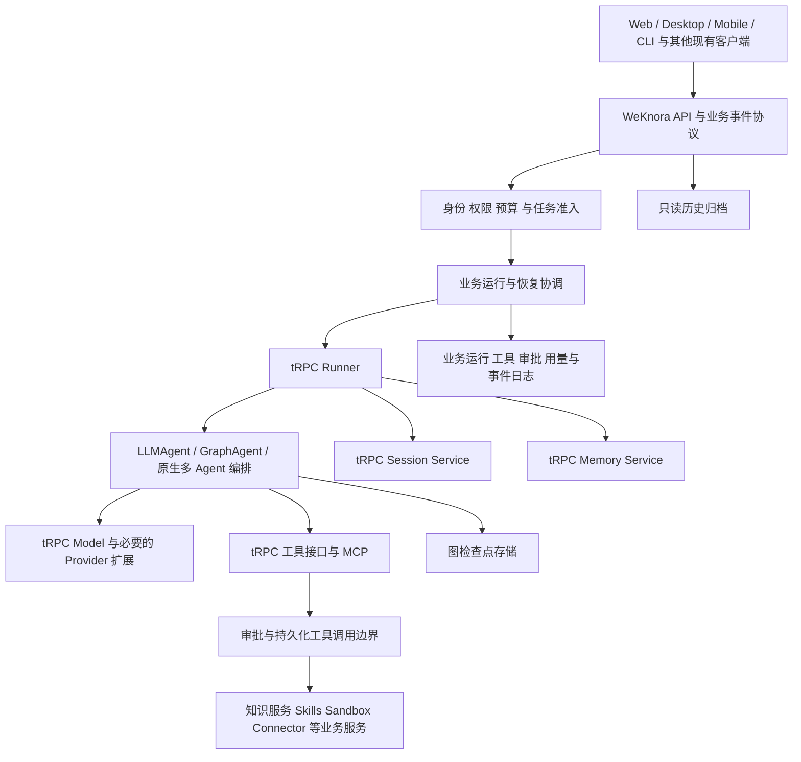

# tRPC 原生 Agent 全面迁移规格

日期：2026-09-19。
状态：对话中的范围、架构、模块替换、归档与验收方向已获确认；本书面规格待用户审阅。尚未批准实施计划或开始产品实现。
基线：`5989f2f354d9423572c9e0dd789c45dc4f6bcf14`；当前 SDK 依赖为 `trpc-agent-go v1.10.0`。

## 1. 目标与已确认决策

在现有仓库建设新的 Agent 子系统，以 tRPC 原生能力替换自研框架机制，首版保留现有全部业务功能；验收后通过维护窗口一次切换。

- 允许调整 API、数据结构与客户端，不要求新旧执行协议兼容。
- 旧数据归档查询；新会话、执行状态、长期记忆与检查点从零开始。旧会话不恢复执行，也不隐式导入新上下文。
- 保留模型配置、知识资源、Agent 配置、MCP 连接、Skills、权限、商业账户及其业务数据。
- 不拆分独立 Agent 服务；开发期间隔离新实现，发布时统一切换。
- 目标是减少自研执行、适配与重复状态管理，不能以调用一次 SDK 或把旧循环搬进 Graph 节点作为完成标准。
- 归档不等于删除；未批准任何历史数据、附件或审计记录的清除。

本规格替代 `2026-09-10-dual-agent-trpc-recovery-design.md` 中双引擎长期共存、旧会话继续执行的目标。该文档保留为历史决策和恢复语义参考。继续遵守 ADR-0001：open-connector 共享运行时，由 WeKnora 控制租户与连接权限；本次不改变其部署边界。

## 2. 当前证据与适用范围

本轮进行了静态检查，未启动服务、运行测试、验证提供商或执行数据库迁移。

| 代码入口 | 当前观察 |
| --- | --- |
| `internal/application/service/agent_service.go` | `CreateAgentEngine` 仍构造自研 Agent |
| `internal/application/service/session_agent_qa.go` | 按会话引擎选择执行路径 |
| `internal/application/service/agent_run_graph.go` | 已存在 tRPC 持久化执行入口和能力装配 |
| `internal/agent/trpc/model.go` | 通过现有 `chat.Chat` 适配 tRPC Model |
| `internal/agent/trpc/graph.go` | 自定义图节点推进模型、工具及结果应用 |
| `internal/agent/trpc/checkpoint.go` | 已有业务存储与框架检查点适配 |
| `internal/types/session.go` | 会话携带引擎类型，默认仍为 builtin |

上述入口是盘点起点，不是完整功能清单。历史测试结果不能直接证明新架构有效。

## 3. 架构与职责

图中工具治理边界适用于每一条真实执行路径，包括原生 MCP 和子 Agent，不能通过框架直连绕过。

- tRPC 承担推理循环、Agent 组合、模型与工具协议、执行上下文、记忆服务及图推进机制。
- WeKnora 承担空间和成员身份、资源权限、凭据、审批、任务预算、计费、知识服务、沙箱与业务工具。
- 业务运行协调层仅承担准入、租约与接管、取消、恢复、审计及事件投影；不再实现另一套推理循环。
- 适配器只处理业务边界或原生组件缺失能力，每个适配器记录原因、覆盖测试和可删除条件。

## 4. 模块替换契约

| 模块 | 目标实现 | 保留契约 |
| --- | --- | --- |
| 模型 | 统一采用 tRPC Model，优先原生 Provider | 配置、凭据隔离、代理与超时、并发约束、多模态、流式、用量与错误语义 |
| Agent | Runner 统一入口，LLMAgent 和 GraphAgent 按验证结果组合 | 取消、执行限制、追加输入、失败处理与恢复 |
| 工具 / MCP | 原生工具协议和经核验的 MCP 组件；业务工具实现新接口 | 授权、审批、发现与名称映射、输出限制、审计与副作用控制 |
| Skills / Sandbox | 核验原生 Skills；通过受控工具接入沙箱 | 安装、授权、版本绑定、文件与工作区隔离、长任务管理 |
| 会话 / 上下文 | tRPC Session Service 为新执行历史权威入口 | 上下文压缩、消息关联、分页查询、多端一致性 |
| 长期记忆 | tRPC Memory Service 接口及受控存储 | 空间与用户隔离、开关、查询、删除和访问权限 |
| 知识资源 | 保留 WeKnora 知识服务，以原生工具接入 | 检索权限、引用与来源、文档和知识库能力 |
| 多 Agent | 原生组合与委派机制 | 子任务身份、权限不扩大、共享任务预算、取消与结果回传 |
| 专业 Agent / 外部执行器 | 按现有功能清单通过受控工具或委派接口接入 | 保留已存在的 Craft / 远程执行等业务能力，不强制重写外部产品内部引擎 |
| 客户端 | 新 API 和统一业务事件协议 | 现有平台的聊天、工具、审批、用量、任务状态及重连体验 |

普通推理优先使用 LLMAgent，需要明确恢复边界的流程使用 GraphAgent；这不是将普通会话排除于恢复要求之外。若 LLMAgent 组合不能满足恢复与工具治理契约，必须改用经过验证的 GraphAgent 组合或受控扩展，不得静默关闭恢复。

首版保留现有多 Agent / 委派能力；引入框架不意味着额外增加尚不存在的产品功能。Agent 之外的模型调用消费者不在无证据的全量删除范围内，共享模型代码仅在消费者完成迁移后清理。

## 5. 数据权威与执行流程

| 数据 | 唯一权威及边界 |
| --- | --- |
| 新会话执行历史 | Session Service；面向 UI 的读模型是可重建投影，不独立维护第二份可写历史 |
| 新长期记忆 | Memory Service；不承担审计或任务恢复 |
| 执行位置和图状态 | Checkpoint 存储；不承担外部副作用完成证明 |
| Run / ToolCall / ToolAttempt / UserDecision | 业务运行日志；记录执行身份、审批、结果与接管资格 |
| 用量和商业结算 | 业务计费记录；框架回调、指标和追踪提供输入，不充当账本 |
| 客户端事件 | 持久化业务事件日志；版本化投影 tRPC 事件并支持重放 |
| 旧历史 | 独立只读归档；不进入新 Runner 的执行状态 |

每个调用绑定空间、用户、会话、任务与尝试身份；子任务绑定父任务和预算根。凭据通过运行时解析，检查点与事件不得携带原始密钥。恢复时校验配置版本并重新检查当前授权，快照不能绕过撤销的权限。

流程：认证与授权 → 预算准入和配置绑定 → 建立 Run → Runner 执行 → 模型输出工具计划 → 持久化计划与审批状态 → 获准后执行工具 → 记录结果 → 推进框架状态 → 投影事件和结算 → 终态。

工具计划必须在外部调用前可靠记录；已确认结果可供恢复复用。框架检查点和业务日志的提交间隙必须有可验证的协调方案，不能假设跨存储天然原子。Session 历史与事件投影通过稳定事件身份去重并可修复。

## 6. 失败、恢复与业务治理

- Run 使用持久化状态、租约和 epoch fencing，过期 Worker 不能提交有效状态；外部系统无法 fencing 时通过幂等或结果核对控制重入。
- 审批和 OAuth 等等待持久化，重启后可继续；用户决策验证归属、有效版本及是否已消费。
- 外部结果不明时，先按工具能力查询或幂等重试；两者均不可用则进入 `waiting_user`，禁止自动重放。
- 客户端断线与任务取消分开；取消需记录并传播到子任务和沙箱，无法确认终止的外部操作继续核对。
- 模型失败或重试使用独立 attempt 身份，流式客户端识别替换尝试，避免拼接废弃文本。
- 事件包含协议版本、任务身份、attempt 和单调序号；重连支持游标和去重。历史缺口明确返回重新同步要求。
- 用量按已发生的调用记录，重放日志不重复收费；父子任务共享任务预算。平台模型和 BYOK 沿用既有商业归属规则。
- 重试范围、次数、超时和取消行为成为明确配置与测试契约，不因更换 SDK 采用未审阅的默认值。

## 7. SDK 版本与能力验证门槛

目前只有依赖版本 `v1.10.0` 已从代码确认；最终版本尚未选择，本规格不声称该版本或最新版本满足全部要求。批准规格后，实施计划的首个交付阶段必须完成版本验证报告，作为下游实现前置门槛。

报告逐项列出：固定版本与源码位置、最小验证方法、结果、缺口、采用原生实现还是必要扩展、受影响的验收项。验证范围包括 Runner 生命周期、LLMAgent/GraphAgent 组合、checkpoint/pending writes/interrupt/resume、Session 历史与压缩、Memory 隔离与删除、Provider 流式与多模态、工具/MCP/Skills 拦截、多 Agent 取消与预算、事件与用量回调。

决策规则：原生满足则采用；升级可满足则固定经验证的新版本并复验；仍有缺口则以最小扩展补足并保留同等功能。若缺口影响本规格职责边界或完整功能目标，返回规格修订，不擅自降级。此验证可以列入实施计划，但产品迁移不得越过该门槛。

官方资料入口（用于验证选题，不能替代固定版本源码与运行证据）：

- https://trpc-group.github.io/trpc-agent-go/agent/
- https://trpc-group.github.io/trpc-agent-go/graph/
- https://trpc-group.github.io/trpc-agent-go/memory/usage/
- https://github.com/trpc-group/trpc-agent-go

## 8. 归档与一次切换

归档覆盖旧会话、消息、工具与审批记录、审计、附件和产物引用；旧长期记忆及执行记录保留为受原权限约束的历史数据，不注入新会话。归档查询必须继续校验当前空间成员资格和资源权限。保留现有删除与保留策略；本次不新增自动清除策略。

业务配置迁移必须生成数量、关联、权限和凭据可解析性的校验报告。新会话表与旧归档在物理表或明确命名空间上隔离；最终选择写入实施计划，读取路由不能依赖含糊的引擎默认值。

上线顺序：

1. 固定基线，盘点现有功能和消费者，完成版本验证。
2. 隔离建设并验证新系统，生产流量仍使用现有系统；真实有副作用工具不做双执行对照。
3. 演练备份、归档、配置迁移、部署和恢复，记录耗时及成功判据。
4. 维护窗口停止新任务，排空或取消旧任务，核对结果不明操作；仍无法安全处理的项目阻止开放新任务。
5. 归档、迁移业务配置、部署匹配的新后端和所有客户端；旧协议收到明确升级提示而非落入旧执行器。
6. 验证归档查询、配置、权限、模型调用、工具审批、计费与流式后，开放新任务。
7. 按实施计划中发布前固定的观察时长、错误率和恢复指标完成观察，再删除旧执行代码；归档查询与必要恢复材料继续保留。

开放新任务前可以恢复旧部署和备份。开放后回退必须先冻结新准入，核对新任务、外部副作用与账务，再执行经演练的修复或回退；数据库恢复不能撤销外部动作。观察指标须在发布前确定，不能在看到失败结果后放宽。

## 9. 功能清单与验收

实施计划必须从实际路由、配置、工具注册、客户端入口和测试建立完整清单，至少覆盖下表。每一项记录稳定 ID、旧实现入口、新实现入口、验证环境、预期、实际结果和证据路径。发现既有缺陷需单独记录，不能以旧实现不稳定为由默认取消功能。

| 范围 | 必须提供的证据 |
| --- | --- |
| 模型 | 现有提供商及配置差异的真实调用，流式、多模态、工具调用、超时、失败和取消 |
| 工具 / MCP / Skills | 每类工具和能力入口、发现、授权、安装、审批、输出限制及外部错误 |
| 知识 | 检索、引用来源、权限拒绝、文档访问及已存在的知识推理入口 |
| Sandbox / 委派 | 文件与工作区隔离、长任务、取消、子任务归属和外部结果不明 |
| 会话 / Memory | 历史、压缩、开关、删除、空间与用户隔离，归档与新数据不串读 |
| 商业治理 | 预算准入、耗尽、父子任务、用量幂等、平台模型与 BYOK 处理 |
| 恢复 | 模型中断、工具调用前后崩溃、检查点提交间隙、审批恢复、双 Worker 与过期租约、事件重放 |
| 客户端 | Web、桌面、现有移动端、CLI 和其他实际使用端分别验证聊天、工具、审批、取消与重连 |
| 数据切换 | 归档权限、附件访问、配置数量与关系、备份恢复、旧客户端行为 |
| 原生化 | 删除旧循环和重复状态管理；每个保留适配器有必要性、测试和责任边界 |

证据层级分开报告：静态检查、单元、集成、真实提供商、浏览器、原生编译、设备运行、故障恢复和发布演练。构建、Mock 和本地轻量模型成功不能代表其他层级通过。缺少凭据、服务或设备的项目标记 `blocked-env`，不得计为通过；必需项存在阻塞或失败时不得上线。

验证面向当前支持的数据库与部署组合，不能仅用 SQLite 证明 PostgreSQL 或反之。真实模型与外部工具执行使用授权测试资源，并保留操作与费用记录。

## 10. 分阶段交付与下一步

本规格只确定一个迁移项目的边界和验收，不是可直接执行的任务计划。实施计划按以下依赖划分可审查交付：功能基线与 SDK 验证 → 数据权威及治理契约 → 核心执行与模型 → 工具/Skills/知识/记忆/委派接入 → 全端协议适配 → 故障与完整功能验收 → 切换演练 → 发布与旧代码退役。具体并行边界由共享接口和文件所有权决定。

书面规格获批后才能编写实施计划；计划须给出任务依赖、受影响文件、验证命令、证据台账、回退条件和执行方式选择。当前未开始实现、迁移、部署或删除旧代码。

## 11. 规格自审

已核对：确认范围完整记录；新历史与归档不混用；业务配置保留与执行数据重建无冲突；原生化不移除权限、计费或副作用治理；版本未知项有明确验证门槛；发布和回退分别覆盖开放新任务前后；验收结果未冒充已完成。具体 SDK 版本、存储命名和发布阈值属于有前置门槛的后续交付，不是对既有事实的猜测。
