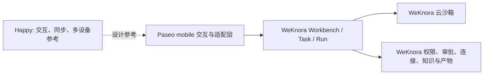

# 移动 AI 办公候选设计

日期：2026-09-20。状态：完整设计待最终核对。本设计汇总已确认访谈决策；它不表示任何客户端、云端执行、加密或共享能力已经实现或验收。

## 架构与边界

WeKnora 是唯一治理和执行权威。首版以 Paseo 移动端为 UI 与适配底座，由适配层调用 WeKnora 的任务、会话、审批、文件和产物能力；它不接入 Paseo daemon 协议。Happy 仅用于交互、同步、版本和多设备设计参考，不采用其云端或加密协议。

任务在可信 WeKnora 云端执行，云沙箱承载获授权的文件、Git 与终端操作。云端可读取任务已授权内容，传输与存储加密、资源按空间归属；这不承诺云端不可读 E2EE。

| 来源 | 复用取舍 |
| --- | --- |
| Paseo | 复用移动 UI 与适配底座；不复用 daemon。 |
| Happy | 借鉴交互、同步、版本和多设备设计；不复用其服务或加密协议。 |
| WeKnora | 保持会话、权限、审批、连接、知识、产物与云端执行的唯一权威。 |

## 模块职责

| 模块 | 职责 |
| --- | --- |
| Paseo mobile 适配层 | 通过 app-owned 窄 `CloudWorkspaceClient` 调用 WeKnora；负责移动导航、会话展示、输入、缓存与通知投影，不持有执行权威或第二状态机。 |
| WeKnora Workbench / Task / Run | 将 Task 映射到既有 session、将多次 Run 映射到执行记录；维护 snapshot、SSE cursor、去重和过期后的全量回补。 |
| 云沙箱与工作区 | 为任务提供独立持久工作区；同任务 Run 复用，跨任务显式导入。 |
| 权限与审批 | 后端在每次访问时检查私有/共享只读 ACL 与 owner 写入权限；workspace ID 仅定位资源，不能替代 tenant/owner 鉴权。 |
| 连接、Git 与发布 | 由 WeKnora 管理凭据、审批后的分支推送与 PR 创建，以及固定版本发布副本。 |

## 任务、运行、共享与文件

Task 以持续会话的 Session ID 为唯一权威，含多次 Run，不新增独立 Task 状态机；继续与重试保留上下文。Run 可持续执行或持久等待审批。任务默认创建者私有；共享成员只读查看对话、运行及获准文件/产物，不能继续执行、使用终端或代创建者审批。

每个 Task 有独立持久工作区。任务结束后文件保留，计算可休眠并在续用时恢复；空间存储配额超限时限制新增写入，仍允许查看、导出和清理，首版不按天自动删除任务文件。用户可选择固定版本发布；原任务仍私有，发布副本遵循目标权限，修改需重新发布，撤销任务共享不影响已发布副本。

Git 在云工作区克隆、修改、查看 Diff 并创建本地 Git 提交；审批后才推送分支并创建 PR，代码平台负责合并。凭据仅由 WeKnora 连接管理，不进入聊天产物；首版没有 force push 或远端删除分支入口。

活跃 Run 的终端仅观察输出。交互 PTY 或人工编辑必须先停止 Run 并确认停止；若副作用结果未知，Run 保持阻断，不能假装已经停止。任务 Owner 使用个人代码平台 Connection，clone 前检查授权；云工作区的修改、Diff 与本地 Git 提交不额外审批。每次 push 分支或创建 PR 必须展示 repo、branch 和具体变更并取得审批；只读共享成员不能使用凭据。

发布目标仅为当前空间的产物资源或指定知识库，按目标权限可见；首版不跨空间发布或提供公开互联网链接，仍可下载和导出。

## 权限矩阵

| 操作 | Task Owner | 只读共享成员 | 发布目标读者 |
| --- | --- | --- | --- |
| 对话、Run、获准文件/产物 | 读写 | 只读 | 仅已发布固定版本的只读访问 |
| 继续执行、终端、审批 | 允许，受后端权限和 Run 状态限制 | 拒绝 | 拒绝 |
| 工作区文件 | 允许写入，受配额与 Run/PTY 互斥限制 | 只读获准文件 | 不访问原工作区 |
| 固定版本发布 | 选择目标并创建副本 | 拒绝 | 按当前空间资源或指定知识库的目标 ACL |
| Git clone / 本地提交 | Owner Connection 授权后允许 | 拒绝使用凭据 | 不适用 |
| push 分支 / 创建 PR | 每次展示具体变更并审批 | 拒绝 | 不适用 |

## 移动、离线与通知

首版覆盖空间切换、Agent 会话、云端任务、审批、文件与产物、知识资源；iOS 与 Android 需要真实验收。Paseo Web 保持可构建，完整 Web 继续由现有 WeKnora 提供。

锁屏默认只提示完成、失败和待审批，不含标题或正文。本地仅缓存可读内容与草稿，按账号和空间隔离加密；退出清理，联网发现撤权即清缓存。离线无法立即撤权，用户可关闭离线缓存；恢复连接后由用户发送，客户端不自动离线审批。

## 移动信息架构与主流程

建议采用 **Home / Tasks / Agents / Me** 四个主入口，并把 **Workspace** 放在任务详情内，避免把文件工作区误解为空间级共享目录。这是工程信息架构建议，不要求用户逐项确认，也不表示任何页面已实现。

主流程为：创建任务时选择空间、Agent、知识资源与附件 → 创建 Run → 查看输出或处理审批 → 查看结果 → 固定版本发布或下载导出。通知打开后先重验权限，再恢复任务状态。任务内 Workspace 提供 Conversation、Files、Git、Terminal 与 Artifacts；活跃 Run 时 Terminal 仅观察，写入流程遵循停止确认与审批边界。

## 分阶段验收

| 阶段 | 静态与自动验证 | 真实验证 |
| --- | --- | --- |
| 适配与任务投影 | 契约、状态映射、权限负例与缓存隔离测试 | iOS/Android 的会话、审批、重开补齐与锁屏通知。 |
| 云端执行与工作区 | Task/Run、文件隔离、配额超限、发布副本与 Git 审批测试 | 真实云沙箱的文件、Git、终端、休眠续用、推分支与 PR。 |
| 权限与撤销 | 私有/只读共享、发布目标权限与撤权缓存清理测试 | 多账号、多空间和撤权后的实际访问验证。 |
| 终端与 Git | Run 停止 CAS、未知结果 `waiting_user`、PTY 互斥、连接授权与逐次远端写审批测试 | 真实云工作区的观察终端、停止确认、push 分支与 PR 创建。 |

静态或 mock 证据不能替代真实设备与真实云端验收。

## 已有代码证据与目标缺口

| 已核对证据 | 可复用基础 | 目标缺口 |
| --- | --- | --- |
| `internal/sandbox/remote_client.go:451` | 云 sandbox 客户端契约及卷能力声明。 | 持久卷与 snapshot provider 的真实兼容性验证。 |
| `internal/router/routes_workbench.go:30`、`internal/types/session.go:75`、`:88`、`internal/agent/runtime/contracts.go:113` | ownership-scoped Workbench 读取、session tenant/owner 与单 active Run、持久 Run 查询视图。 | Task/session/run 映射、cursor 恢复与客户端投影。 |
| `internal/application/service/craft_artifacts.go:121`、`:214` | 不可变 digest 产物收集基础。 | 固定版本发布副本及其独立 ACL；不得级联原任务共享。 |
| `internal/application/service/workbench/notification_delivery.go:256`、`migrations/versioned/000145_mobile_devices.up.sql:1` | 推送前重验权与 iOS/Android 设备登记基础。 | 锁屏最小内容、账号/空间缓存加密与撤权清理。 |
| `/Users/wuyongjun/trea/paseo/packages/app/src/runtime/host-runtime.ts:507`、`/Users/wuyongjun/trea/paseo/packages/app/src/runtime/replica-cache/row-store.native.ts:1` | Paseo 现有 daemon client 耦合与 SQLite replica 存储。 | `CloudWorkspaceClient` 适配 WeKnora，避免新增 daemon 消费者。 |
| `/Users/wuyongjun/trea/happy/packages/happy-wire/src/sessionProtocol.ts:1` | 协议文件明确禁止新增消费者。 | 不以 Happy wire 协议承载本设计。 |

工程实现须保持一条 WeKnora 状态权威：Task 使用 session ID，不新增独立 Task 状态机；移动端 SSE 使用 snapshot/cursor/去重，cursor 过期时全量回补；缓存 key 含 backend、account、tenant，scope 变化即丢弃旧流；权限判断始终由后端完成。云 sandbox 的持久卷和 snapshot provider 必须经过真实验证后才可声称支持休眠续用。

## 最小接口契约（工程拟新增）

| 类别 | 契约与关键字段 | 权限与并发 |
| --- | --- | --- |
| 查询（existing + 扩展） | `GET WorkbenchSnapshot{session_id, run_id?, scope, seq, cursor, items}`；现有 Workbench 读取为基础。 | 后端校验 tenant、owner 或共享只读 ACL；cursor 过期返回 snapshot。 |
| 命令（proposed） | `POST RunCommand{session_id, request_id, expected_revision, kind, payload}`。 | `request_id` 幂等；`expected_revision` CAS 冲突返回当前 snapshot。 |
| 审批（existing + 扩展） | `POST Decision{run_id, decision_id, interaction_id, action_id, approved_args_hash, credential_version, expected_revision, outcome}`。 | `decision_id` 幂等；批准内容或凭据版本变化须重新批准。未知副作用进入 `waiting_user`，先对账后才可重试。 |
| 终端（proposed） | `GET TerminalObserve{session_id, run_id, cursor}`；`POST RunStop{request_id, expected_revision}`。 | 活跃 Run 禁止交互 PTY 与人工写入；启动 Run 前也须收回既有 PTY 写权限，停止确认前不开放写入。 |
| 发布（proposed） | `POST PublishVersion{session_id, version_digest, target_kind, target_id, request_id}`。 | 固定版本创建独立 ACL；目标仅当前空间资源或指定知识库，不随任务共享级联。 |
| Git（proposed） | `POST GitRemoteWrite{session_id, connection_id, action_type, repo, branch, commit_sha, pr_base, pr_head, diff_digest, request_id}`。 | Owner Connection、clone 授权；每次 push/PR 以精确 commit/PR base/head 和 action type 审批，任一批准后字段变化须重新批准，只读成员拒绝。 |

这些是工程接口候选，不是已实现 HTTP 路线；现有 Workbench、Run、产物与通知代码仅构成基础。

## Source manifest

| 仓库 | origin 与固定 HEAD | 脏状态与参考路径 |
| --- | --- | --- |
| WeKnora-fork01 | `github.com/1123786563/WeKnora-fork01.git` `f7802c47c82835514e4a5d30457222b6c0e891d9` | 脏：本设计文档及并发中的测试、UI、Semantica 修改；参考 `internal/sandbox/remote_client.go`、`internal/router/routes_workbench.go`、`internal/types/session.go`、`internal/agent/runtime/contracts.go`、`internal/application/service/craft_artifacts.go`、`internal/application/service/workbench/notification_delivery.go`、`migrations/versioned/000145_mobile_devices.up.sql`。 |
| Paseo | `github.com/getpaseo/paseo.git` `d636abd7a4ce302e7ccb9eb6074f637c6dd4d83b` | 干净；参考 `packages/app/src/runtime/host-runtime.ts`、`packages/app/src/runtime/replica-cache/row-store.native.ts`。 |
| Happy | `github.com/slopus/happy.git` `ac64b9b4677870f7b7a9eacfd0780959229717f1` | 脏：`pnpm-workspace.yaml`、未跟踪 `.mimosa/`；参考 `packages/happy-wire/src/sessionProtocol.ts`。 |

各仓库工作区脏状态不能只凭 SHA 重现；以上路径与 SHA 一起构成可复核的源码基线。

## 被取代的历史移动架构文档

下列文档顶部已标注本设计为当前移动与云端架构依据，原任务、进度及未涉及的后端设计仍保留作历史参考：

- [Happy 统一 Agent 移动客户端设计](2026-09-10-happy-agent-mobile-design.md)
- [移动端 AI SaaS Agent 工作台技术架构](2026-09-12-mobile-ai-saas-workbench-architecture.md)
- [Happy 总计划](../plans/2026-09-10-happy-agent-mobile.md)
- [01 基础](../plans/2026-09-10-happy-mobile-01-foundation.md)、[02 会话](../plans/2026-09-10-happy-mobile-02-conversations.md)、[03 资源](../plans/2026-09-10-happy-mobile-03-resources.md)、[04 通知](../plans/2026-09-10-happy-mobile-04-notifications.md)、[05 语音](../plans/2026-09-10-happy-mobile-05-voice.md)、[06 远程](../plans/2026-09-10-happy-mobile-06-remote.md)、[07 交付](../plans/2026-09-10-happy-mobile-07-delivery.md)

本轮复核了 [领域词汇](../../../CONTEXT.md)、[访谈台账](2026-09-20-mobile-ai-office-design-interview.md)、[ADR-0003](../../adr/0003-paseo-mobile-weknora-trusted-cloud.md) 及上表列出的源码路径。代码证据仅说明可复用基础，不代表目标缺口已实现或验收。
